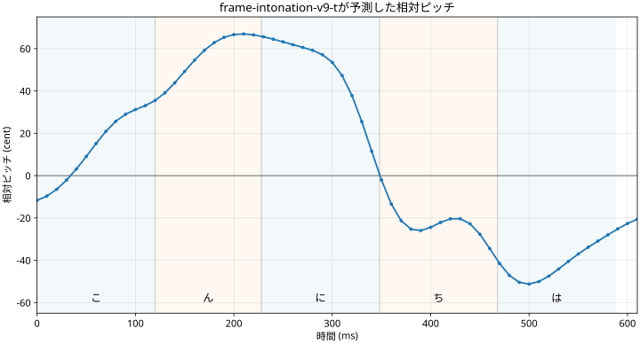

# 音声合成の仕組み

UtauTTSは、UTAUボイスバンクに収録された短い声をつないで文章を読み上げます。分類としては連結型音声合成になります。

「あ」「か」「a か」といった原音を選び、長さと高さを調整して境界を少しずつ重ねます。抑揚モデルが担当するのは声をいつ上げ下げするかです。

文章からWAVまでの流れは、次のようになります。

1. 文章を読みとモーラに分ける
2. ボイスバンクから使えそうな原音を探す
3. oto.iniを見て、各原音を置く時刻を決める
4. 10ミリ秒ごとの抑揚曲線を作る
5. 原音の長さと高さを変え、重ねて一つの波形にする

## 文章を分ける

日本語の読み上げでは文字数よりモーラ数のほうが役に立ちます。モーラは日本語の拍を数える単位で「こんにちは」なら「こ・ん・に・ち・は」の5モーラ。「きゃ」は2文字でも1モーラで、「っ」や「ん」もそれぞれ1モーラです。

読みとモーラを求めるのと同時にOpen JTalkから単語の境界、品詞、アクセント句の長さ、アクセント核の位置などを受け取ります。

## 原音を文全体で選ぶ

ボイスバンクにはいくつかの収録形式があります。

| 形式 | 原音の例 | 使い方 |
| --- | --- | --- |
| CV（単独音） | か | 子音と母音を一組で使う |
| VCV（連続音） | a か | 前の母音から次の音へ移る部分ごと使う |
| CVVC | あ + a k + か | 前の母音から次の子音へ渡すVC原音を間に挟む |

VCVのoto.iniは長い録音を前提にした値になりやすいため、短いモーラへ置くときは先行発声とfixedを調整します。子音の遷移を残しながら母音末尾を確保し、停止音の閉鎖区間を接続scoreが過剰に悪く評価しないようにします。

同じ「か」でも音階違いや収録方式の違いで候補がいくつも見つかることがあります。そこで最初に見つかった原音をそのまま使うのではなく文の区切りまで候補を並べてから一番無理のない組み合わせを選びます。

選び方を式にするとこうなります。

$$
S(U)=\sum_i L(u_i)+\sum_{i=2}^{N}J(u_{i-1},u_i)
$$

$U=(u_1,u_2,\ldots,u_N)$は選んだ原音の並びです。CVVCの場合の$u_i$は、VC原音と主な原音をまとめた一つの候補として扱います。$L(u_i)$は「このモーラにこの原音がどれくらい合うか」、$J(u_{i-1},u_i)$は「前後の原音がどれくらいつながりやすいか」を表します。

$L$では、希望した音階や音色、CV・VCV・CVVCの種類、代替候補へ落ちた回数などを見ます。$J$で見るのは、境界付近の音量、周波数成分、基本周波数などです。すべての組み合わせを力任せに試さなくても済むように、Viterbi法で合計点の高い経路を探しています。

同じ録音WAV内で次の原音へ進む候補には連続性の加点があります。加点はアンカー間の距離で減らしません。複数モーラを一つのファイルへ収録した音源では、距離で加点を減らすと遷移音を選び損ねるためです。

接続点だけを見れば、別の原音を選んだほうが滑らかな場合もあります。でも、それで別の発音に置き換わることはありません。候補は発音に必要な音素文脈とボイスバンク側の指定から作り、境界の点数はその中での選択に使います。同じ音素文脈の表記違い（例: C+Vで文中に試す`- V`と`V`）は、前後のつながりやすさで順位が入れ替わることがあります。

### 関連する音声合成方式

UtauTTSはAppleが2017年に公開したSiriのTTSと似ている部分があります。[Appleの解説](https://machinelearning.apple.com/research/siri-voices)と[Interspeech 2017の論文](https://www.isca-archive.org/interspeech_2017/capes17_interspeech.html)では、これをhybrid unit selectionと呼んでいます。

Siriはニューラルネットワークで波形を直接作る方式ではなく、言語情報からスペクトル、基本周波数、長さなどの分布を予測します。その情報から発音への適合度を表すtarget costと、前後の接続しやすさを表すconcatenation costを計算し、Viterbi探索で録音済みunitの並びを選んで波形を接続します。原音候補を並べ、発音と接続の両方の評価で経路を選ぶ点はUtauTTSと共通しています。

規模は大きく異なります。論文のシステムは48 kHzで収録した15時間以上の専用音声から、100万〜200万個ほどのhalf-phoneを作っていますが、通常のUTAUボイスバンクでは一つの文脈に使える候補が数個、ボイスバンクによっては一つだけです。

## モーラの長さを決める

既定のframe-intonation-tcn-v9.1-tが予測するのは抑揚だけで、モーラ長はモデルでは予測しません。モーラ長はGUIで指定した基準モーラ長と言語別の時間規則で決め、「ん」は0.9倍、「ー」は1.2倍、「っ」は通常のモーラと同じ基準長にします。GUIで手動指定した長さがある場合はその値を優先します。

モーラ$i$の長さを$D_i$とすると基準時刻は前から順に

$$
T_1=0,\qquad T_{i+1}=T_i+D_i
$$

と決まります。句読点による間も独立した長さとして加わります。

## oto.iniを見る

原音WAVをどこから使うか、子音をどの範囲として扱うかは`oto.ini`に記録されています。

| 値 | 書かれていること |
| --- | --- |
| offset | WAVの先頭から、原音として使い始める位置まで |
| consonant | 主に子音として、長さをなるべく保つ範囲 |
| cutoff | WAVの末尾から除外する範囲、または原音として使う長さ |
| preutterance | 発音の基準より何ミリ秒前から鳴らすか |
| overlap | 前の原音と重ねる位置の目安 |

モーラの基準時刻を$T_i$、実際に使う先行発声を$P_i$とすると、原音を置き始める時刻$B_i$はおおよそ次のようになります。

$$
B_i=T_i-P_i
$$

「か」のkは、母音aが聞こえ始めるより前にあります。$T_i$から原音を鳴らし始めるとkが遅れたり、途中からしか聞こえなかったりします。そこで先行発声の分だけ前へずらし、前の音と重ねます。

この計算を文頭で行うと$B_1$が負になることがあります。負の部分が出力の外へ出ないよう、発話全体の前に余白を追加します。waveform Rendererでは、各原音の配置時刻から必要な長さを次のように求めます。

$$
M=\max(0,-\min_i B_i)
$$

WORLD系Rendererでは最初の原音の配置時刻から同じ余白を求めます。通常はどのRendererでも同じ結果になります。GUIの「文頭の長さ」を自動以外にすると、この余白に上限を設定し、先行発声に含まれる不要なノイズを切り落とせます。要点は、文頭の子音が収まるだけ発話全体を前へずらすことです。

## 包絡線を使って原音を重ねる

二つの原音をそのまま足すと重なった場所だけ音が大きくなります。境界で波形が急に変わればクリック音も出るので、音量を時間に沿って上げ下げする包絡線が必要です。

下のグラフは、前後ともモーラ長180ms、先行発声80ms、オーバーラップ40msとした例です。線の座標は、Classic UTAUの内蔵wavtoolで使う5点包絡線の式から計算しています。実際の形はoto.iniとモーラ長によって変わります。

Classic UTAUの内蔵wavtoolでは、一つの原音を$p_0$から$p_4$までの5点で扱います。$p_0$では音量0から始まり、$p_1$で1になります。$p_2$から$p_3$まではそのまま鳴らし、$p_4$へ向かって再び0まで下げます。各点の位置は固定ではなくoto.iniと前後のモーラ長から決まります。

時刻$t$での原音$i$の波形を$x_i$、包絡線を$e_i$、配置時刻を$B_i$とします。最終的な波形$y(t)$は概念上は次の足し算です。

$$
y(t)=\sum_i e_i(t-B_i)\,x_i(t-B_i)
$$

原音を決めた時刻へ置き、包絡線で音量を調整しながら加算します。

## 子音を保ちながら長さを変える

録音されている原音の長さと読み上げに必要な長さは異なります。全体を同じ比率で縮めると子音や母音のバランスが変わります。

子音を強く縮めると「す」が「つ」に聞こえるような発音の変化が起きます。そのためconsonantまでの範囲はなるべく保ち、後ろにある持続しやすい母音を中心に伸縮します。

Classic UTAUでは選択したresamplerが原音を指定した長さと高さへ変換します。Goだけで動くwaveform Rendererは可変レートのリサンプリングとWSOLAで同じ目的を実現します。再生速度だけを変える処理とは異なり、子音と母音の時間配分を扱います。

## 抑揚を予測する

標準のframe-intonation-tcn-v9-tモデルが出力するのは音声ではなく、10ミリ秒ごとの高さです。下のグラフは「こんにちは。」を入力し、基準モーラ長120ms、抑揚の強さ1.0で実際に予測した62点を描いています。「ん」はモデル入力前の長さ規則により108msです。

モデルへ渡すのは現在のモーラ、モーラ内での進み具合、単語境界、アクセント句内の位置、アクセント核との距離、品詞、文のどこまで進んだかといった情報です。小さなTCN（時間方向の畳み込みニューラルネットワーク）が前後を見ながら各時刻の高さをcentで返します。細かすぎる揺れは後から均して極端な上下も制限します。

centは周波数そのものではなく周波数の比を表す単位です。基準周波数$F_{\mathrm{ref}}$と現在の基本周波数$F_0$の関係は

$$
c=1200\log_2\left(\frac{F_0}{F_{\mathrm{ref}}}\right)
$$

となります。逆にcent値$c$を周波数の倍率へ戻すなら

$$
r(c)=2^{c/1200}
$$

です。+100 centで半音一つ、+1200 centなら1オクターブ上、つまり周波数は2倍です。

モデルは絶対的なHzではなく、学習に使った話者の声の高さをボイスバンクへ移さない相対値を予測します。原音$i$から測った基本周波数を$F_{\mathrm{src},i}$、原音間の高さを安定させる補正や別の指定値によるモーラ単位の補正を$q_i$、時刻$t$でモデルが出した値を$c(t)$とすると目標の高さはおおよそ

$$
F_{\mathrm{target},i}(t)
=F_{\mathrm{src},i}\,q_i\,2^{c(t)/1200}
$$

です。これにより、音源本来の高さを保ったまま上がり下がりの形を適用できます。

GUIで抑揚を動かすと手で直したcent値が自動曲線へ加わるか自動曲線と置き換わります。モーラ長を予測するモデルを選んだ場合も同じでモデルの値を最初からGUIに出し、人が触った場所だけを優先します。

## Rendererごとの違い

文章解析、原音選択、抑揚曲線までは共通です。その先の波形処理にはいくつかの選択肢があります。

| Renderer | 処理内容 |
| --- | --- |
| waveform | Go内で原音を切り出し時間伸縮して包絡線を掛けて足す |
| UtauTTS WORLD phrase | 公式WORLDで原音を分析し、UtauTTS側で音響特徴を配置してフレーズを一度に再合成する |
| Classic UTAU | UTAU互換resamplerで原音を加工し、wavtoolまたは内蔵処理で重ねる |

waveformとClassic UTAUは「加工済みの原音を最後に重ねる」方式。UtauTTS WORLD phraseは「原音の特徴を並べてから、最後に一つの声へ戻す」方式です。元になる原音とタイミングは共通なので、Renderer同士の差は小さく聞こえることもあります。

## この方式の制約

収録されていない発音や文脈は接続処理を工夫しても作れません。原音の種類や数、録音品質、oto.iniの精度、原音の圧縮率によってはTTSに向かないボイスバンクもあります。
